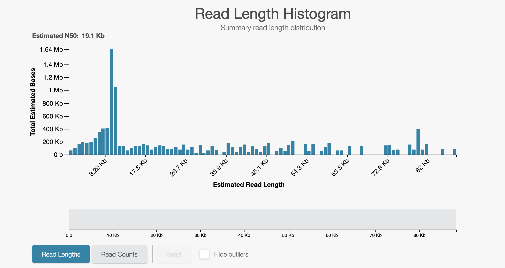
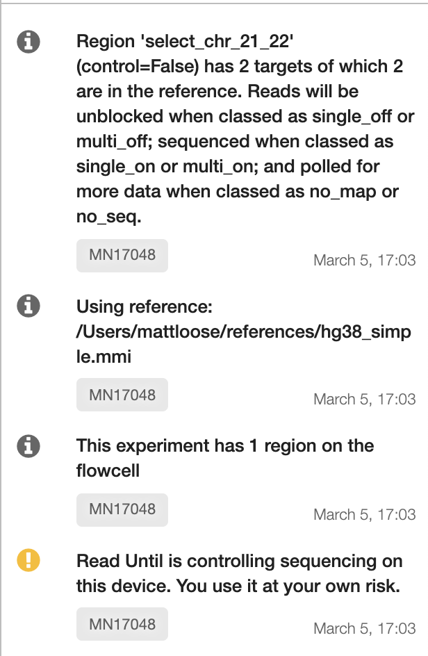

# 

If you are anything like us, reading a README is the last thing you do when running code. 
PLEASE DON'T DO THAT FOR READFISH. This will effect changes to your sequencing and - 
if you use it incorrectly - cost you money. We have added a [list of GOTCHAs](#common-gotchas) 
at the end of this README. We have almost certainly missed some... so - if something goes 
wrong, let us know so we can add you to the GOTCHA hall of fame!

This is a Python3 package that integrates with the 
[Read Until API](https://github.com/nanoporetech/read_until_api). However, we use 
a slightly modified version - [Read Until API V2](https://github.com/looselab/read_until_api_v2).  

The Read Until API provides a mechanism for an application to connect to a
MinKNOW server to obtain read data in real-time. The data can be analysed in the
way most fit for purpose, and a return call can be made to the server to unblock
the read in progress and so direct sequencing capacity towards reads of interest.

**This implementation of ReadFish requires Guppy version 3.4.5. and MinKNOW version core 3.6. It will not work on earlier versions and performance is not currently guranteed on later versions.**

**Update - 21/08/2020 - We currently have a pre-release version of ReadFish available which is compatible with MinKNOW 4.0 and Guppy 4. See the [PyPI](https://pypi.org/project/readfish/0.0.5a2/) page for installation instructions.** 

**Guppy 3.4.5 is available from here https://mirror.oxfordnanoportal.com/software/analysis/ont-guppy_3.4.5_linux64.tar.gz **

**Currently we only recommend LINUX for running ReadFish. We have not had 
effective performance on other platforms to date.**

The code here has been tested with Guppy in GPU mode using GridION Mk1 and 
NVIDIA RTX2080 on live sequencing runs and an NIVIDA GTX1080 using playback 
on a simulated run (see below for how to test this).  
This code is run at your own risk as it DOES affect sequencing output. You 
are **strongly** advised to test your setup prior to running (see below for 
example tests).

Citation
--------
If you use this software please cite: [10.1101/2020.02.03.926956](https://dx.doi.org/10.1101/2020.02.03.926956)

> Nanopore adaptive sequencing for mixed samples, whole exome capture and targeted panels 
>  
> Alexander Payne, Nadine Holmes, Thomas Clarke, Rory Munro, Bisrat Debebe, Matthew Loose
> 
>bioRxiv 2020.02.03.926956; doi: https://doi.org/10.1101/2020.02.03.926956

Installation
------------
```bash
# Make a virtual environment
python3 -m venv readfish
. ./readfish/bin/activate
pip install --upgrade pip

# Install our ReadFish Software
pip install git+https://github.com/LooseLab/read_until_api_v2@master
pip install git+https://github.com/LooseLab/readfish@master
```

Usage
-----
```bash
# check install
$ readfish
usage: readfish [-h] [--version]
                {targets,align,centrifuge,unblock-all,validate,summary} ...

positional arguments:
  {targets,align,centrifuge,unblock-all,validate,summary}
                        Sub-commands
    targets             Run targeted sequencing
    align               ReadFish and Run Until, using minimap2
    centrifuge          ReadFish and Run Until, using centrifuge
    unblock-all         Unblock all reads
    validate            ReadFish TOML Validator
    summary             Summary stats from FASTQ files

optional arguments:
  -h, --help            show this help message and exit
  --version             show program's version number and exit

See '<command> --help' to read about a specific sub-command.

# example run command - change arguments as necessary:
$ readfish targets --experiment-name "Test run" --device MN17073 --toml example.toml --log-file RU_log.log
```

TOML File
---------
For information on the TOML files see [TOML.md](TOML.md).

Testing
-------
To test readfish on your configuration we recommend first running a playback 
experiment to test unblock speed and then selection.

#### Configuring bulk FAST5 file Playback
1. Download an open access bulk FAST5 file from 
[here](http://s3.amazonaws.com/nanopore-human-wgs/bulkfile/PLSP57501_20170308_FNFAF14035_MN16458_sequencing_run_NOTT_Hum_wh1rs2_60428.fast5). 
This file is 21Gb so make sure you have plenty of space.
1. To configure a run for playback, you need to find and edit a sequencing TOML 
file. These are typically located in `/opt/ont/minknow/conf/package/sequencing`. 
Edit a file such as sequencing_MIN106_DNA.toml and under the entry `[custom_settings]` 
add a field: 
    ```text
    simulation = "/full/path/to/your_bulk.FAST5"
    ```
3. If running GUPPY in GPU mode, set the parameter `break_reads_after_seconds = 1.0` 
to `break_reads_after_seconds = 0.4`.
4. In the MinKNOW GUI, right click on a sequencing position and select `Reload Scripts`. 
Your version of MinKNOW will now playback the bulkfile rather than live sequencing.
5. Insert a configuration test flowcell into the sequencing device.
6. Start a sequencing run as you would normally, selecting the corresponding flow 
cell type to the edited script (here FLO-MIN106) as the flowcell type.
7. The run should start and immediately begin a mux scan. Let it run for around 
five minutes after which your read length histogram should look as below:
    

#### Testing unblock response
Now we shall test unblocking by running `ru_unblock_all` which will simply eject 
every single read on the flow cell. 
1. To do this run:
    ```bash
    readfish unblock-all --device <YOUR_DEVICE_ID> --experiment-name "Testing ReadFish Unblock All"
    ```   
1. Leave the run for a further 5 minutes and observe the read length histogram. 
If unblocks are happening correctly you will see something like the below:
    
A closeup of the unblock peak shows reads being unblocked quickly:
        

If you are happy with the unblock response, move onto testing basecalling.

#### Testing basecalling and mapping.
To test selective sequencing you must have access to a 
[guppy basecall server](https://community.nanoporetech.com/downloads/guppy/release_notes) (>=3.4.0) 
and configure a [TOML](TOML.md) file. Here we provide an [example TOML file](examples/human_chr_selection.toml).
1. First make a local copy of the example TOML file:
    ```bash
    curl -O https://raw.githubusercontent.com/LooseLab/readfish/master/examples/human_chr_selection.toml
    ```
1. Modify the `reference` field in the file to be the full path to a [minimap2](https://github.com/lh3/minimap2) index of the human genome.
1. Modify the `targets` fields for each condition to reflect the naming convention used in your index. This is the sequence name only, up to but not including any whitespace.
e.g. `>chr1 human chromosome 1` would become `chr1`. If these names do not match, then target matching will fail.
1. We provide a [JSON schema](readfish/static/readfish_toml.schema.json) and a script for validating 
configuration files which will let you check if the toml will drive an experiment as you expect:
    
    ```bash
    readfish validate human_chr_selection.toml
    ```

    Errors with the configuration will be written to the terminal along with a text description of the conditions for the experiment as below.
    
    ```text
    readfish validate examples/human_chr_selection.toml
    😻 Looking good!
    Generating experiment description - please be patient!
    This experiment has 1 region on the flowcell

    Using reference: /path/to/reference.mmi

    Region 'select_chr_21_22' (control=False) has 2 targets of which 2 are
    in the reference. Reads will be unblocked when classed as single_off
    or multi_off; sequenced when classed as single_on or multi_on; and
    polled for more data when classed as no_map or no_seq.
    ```         
1. If your toml file validates then run the following command:
    ```bash
    readfish targets --device <YOUR_DEVICE_ID> \
                  --experiment-name "RU Test basecall and map" \
                  --toml <PATH_TO_TOML> \
                  --log-file ru_test.log
    ```
1. In the terminal window you should see messages reporting the speed of mapping of the form:
    ```text
    2020-02-24 16:45:35,677 ru.ru_gen 7R/0.03526s
    2020-02-24 16:45:35,865 ru.ru_gen 3R/0.02302s
    2020-02-24 16:45:35,965 ru.ru_gen 4R/0.02249s
    ```
   **Note: if these times are longer than 0.4 seconds you will have performance issues. Contact us via github issues for support.**

1. In the MinKNOW messages interface you should see the experiment description as generated by the ru_validate command above.   
         

 #### Testing expected results from a selection experiment.
 
 The only way to test readfish on a playback run is to look at changes in read length for rejected vs accepted reads. To do this:
 
 1. Start a fresh simulation run using the bulkfile provided above.
 2. Restart the readfish command (as above):
    ```bash
    readfish targets --device <YOUR_DEVICE_ID> \
                  --experiment-name "RU Test basecall and map" \
                  --toml <PATH_TO_TOML> \
                  --log-file ru_test.log
    ```
 3. Allow the run to proceed for at least 15 minutes (making sure you are writing out read data!).
 4. After 15 minutes it should look something like this:
        
Zoomed in on the unblocks: 
        
 4. Run `readfish summary` to check if your run has performed as expected. This file requires the path to your toml file followed by the path to your fastq reads. Typical results are provided below and show longer mean read lengths for the two selected chromosomes (here chr21 and chr22). Note the mean read lengths observed will be dependent on system performance. Optimal guppy configuration for your system is left to the user.
     ```text
     contig  number      sum   min     max    std   mean  median     N50
       chr1    1326  4187614   142  224402  14007   3158     795   48026
      chr10     804  2843010   275  248168  15930   3536     842   47764
      chr11     672  2510741   184  310591  18572   3736     841   73473
      chr12     871  2317742   292  116848   9929   2661     825   37159
      chr13     391  1090012   227  189103  12690   2788     781   41292
      chr14     469  2323329   275  251029  20107   4954     830   68887
      chr15     753  2189326   180  154830  12371   2907     812   40686
      chr16     522  1673329   218  166941  12741   3206     862   39258
      chr17     484  1609208   191  169651  15777   3325     816   73019
      chr18     483  1525953   230  252901  14414   3159     813   40090
      chr19     664  1898289   249  171742  13181   2859     820   46271
       chr2    1474  4279420   234  222310  13090   2903     820   43618
      chr20     489  1622910   229  171322  13223   3319     887   33669
      chr21      32  1221224  1053  223477  56923  38163   13238  112200
      chr22      47   724863   244  184049  28113  15423    6781   33464
       chr3    1142  3554814   243  247771  15173   3113     760   62683
       chr4    1224  4402210   210  221084  15769   3597     820   66686
       chr5    1371  4495150   205  330821  16699   3279     801   65394
       chr6     978  2725891   246  146169  10995   2787     791   37791
       chr7    1039  3027136   166  263043  14705   2914     798   56567
       chr8     848  2581406   238  229150  15618   3044     772   44498
       chr9     893  3028224   259  247975  16011   3391     802   54953
       chrM     144   216047   215   20731   2562   1500     864    1391
       chrX     868  3124552   238  192451  15594   3600     832   49047
       chrY       8    47071   510   31654  10743   5884    1382   31654    
    ```
 **After completing your tests you should remove the simulation line from the sequencing_MIN106_DNA.toml file. You MUST then reload the scripts. If using Guppy GPU basecalling leave the break_reads_after_seconds parameter as 0.4.** 
 
 Common Gotcha's
 ----
 These may or may not (!) be mistakes we have made already...
 1. If the previous run has not fully completed - i.e is still basecalling or processing raw data,you may connect to the wrong instance and see nothing happening. Always check the previous run has finished completely.
 2. If you have forgotten to remove your simultation line from your sequencing toml you will forever be trapped in an inception like resequencing of old data... Don't do this!
 3. If basecalling doesn't seem to be working check:
    - Check your basecalling server is running.
    - Check the ip of your server is correct.
    - Check the port of your server is correct.
 4. If you are expecting reads to unblock but they do not - check that you have set `control=false` in your ru_generators toml file.  `control=true` will prevent any unblocks but does otherwise run the full analysis pipeline.
 5. Oh no - every single read is being unblocked - I have nothing on target! 
    - Double check your reference file is in the correct location.
    - Double check your targets exist in that reference file.
    - Double check your targets are correctly formatted with contig name matching the record names in your reference (Exclude description - i.e the contig name up to the first whitespace). 
 6. **Where has my reference gone?** If you are using a _live TOML file - e.g running iter_align or iter_cent, the previous reference MMI file is deleted when a new one is added. This obviosuly saves on disk space use(!) but can lead to unfortunate side effects - i.e you delete yoru MMI file. These can of course be recreated but user **beware**.
 
 Happy ReadFishing!

  Acknowledgements
 ----

We're really grateful to lots of people for help and support. Here's a few of them...

From the lab:
Teri Evans, Sam Holt, Lewis Gallagher, Chris Alder, Thomas Clarke

From ONT:
Stu Reid, Chris Wright, Rosemary Dokos, Chris Seymour, Clive Brown, George Pimm, Jon Pugh

From the Nanopore World:
Nick Loman, Josh Quick, John Tyson, Jared Simpson, Ewan Birney, Alexander Senf, Nick Goldman, Miten Jain

And for our Awesome Logo please checkout out [@tim_bassford](https://twitter.com/tim_bassford) from [@TurbineCreative](https://twitter.com/TurbineCreative)!

### Research notice

Please note that this repository is participating in a study into sustainability of open source projects. Data will be gathered about this repository for approximately the next 12 months, starting from June 2021.

Data collected will include number of contributors, number of PRs, time taken to close/merge these PRs, and issues closed.

For more information, please visit [the informational page](https://sustainable-open-science-and-software.github.io/) or download the [participant information sheet](https://sustainable-open-science-and-software.github.io/assets/PIS_sustainable_software.pdf).
  
